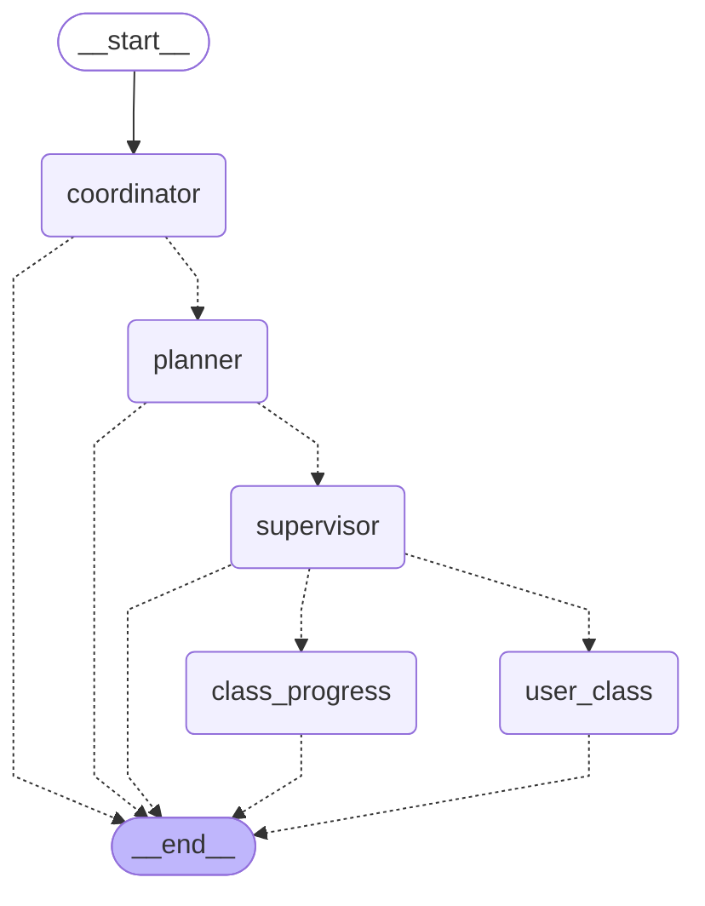

# 학습지 챗봇 그래프 (coordinator · planner · supervisor · 일꾼 둘)

```mermaid
---
config:
  flowchart:
    curve: linear
---
graph TD;
	__start__([<p>__start__</p>]):::first
	coordinator(coordinator)
	planner(planner)
	supervisor(supervisor)
	user_class(user_class)
	class_progress(class_progress)
	__end__([<p>__end__</p>]):::last
	__start__ --> coordinator;
	class_progress -.-> __end__;
	coordinator -.-> __end__;
	coordinator -.-> planner;
	planner -.-> __end__;
	planner -.-> supervisor;
	supervisor -.-> __end__;
	supervisor -.-> class_progress;
	supervisor -.-> user_class;
	user_class -.-> __end__;
	classDef default fill:#f2f0ff,line-height:1.2
	classDef first fill-opacity:0
	classDef last fill:#bfb6fc
```
